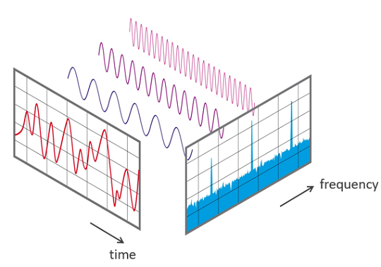
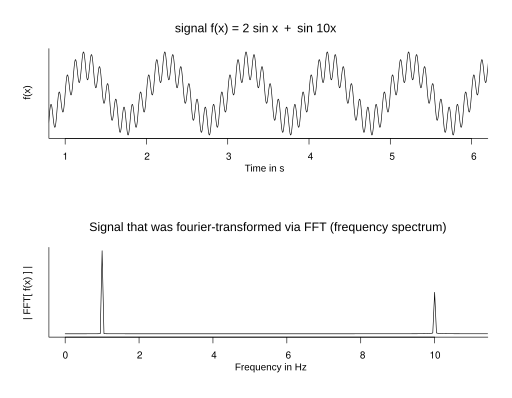
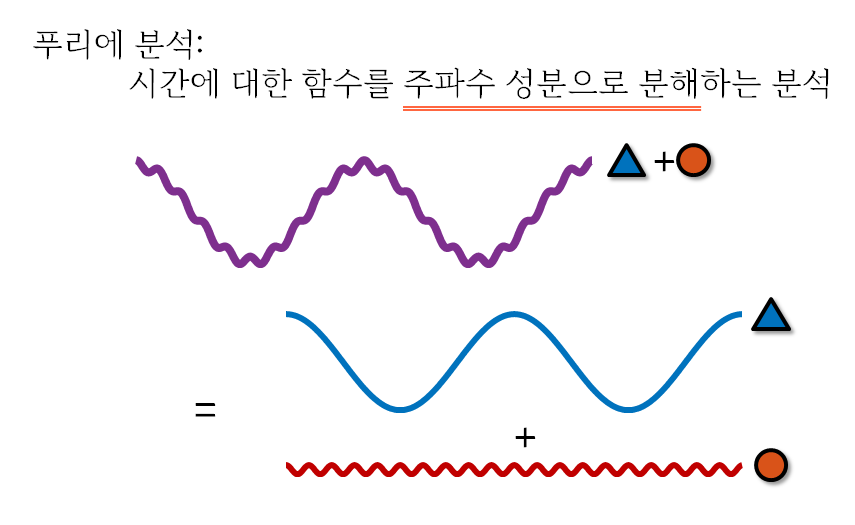
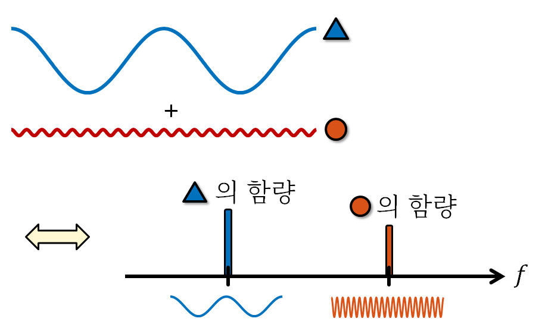

# Description of Fast-Fourier-Transform (FFT)

- 주기 (T): 1회전에 걸리는 시간 (s, second)
- 주파수 (f): 1초 동안의 회전수 (Hz = 1/s)
- 각속도$\left(\omega\right)$: 시간에 따른 회전 각도의 변화율 (rad/s)
### $\omega = 2 \pi f =  \frac{2 \pi}{T} $
- 1회전 == 2 $\pi$ rad 이므로, 1초 동안 f번 회전을 할 때 회전 각도는 $2 \pi f$.
- [angle $\leftrightarrow$ time domain] 시간 $t$에 대해 회전 각도 $\theta = \omega t = 2 \pi f t$.

- 따라서

    (1) angle(rad) domain에서 $ y = \sin\left(\theta\right) $  
    $ \Leftrightarrow $  
    (2) time domain에서 $ y = \sin\left(2\pi ft\right)$

- Generally, signal $ v\left(t\right) = V_{p} \sin\left(\theta + \phi \right) = V_{p} \sin\left(2 \pi f t + \phi \right) $, $\phi$: phase

https://www.nti-audio.com/en/support/know-how/fast-fourier-transform-fft  

## Fourier Transform
1. Time/Spatial domain $\rightarrow$ frequency domain
https://en.wikipedia.org/wiki/File:Simple_time_domain_vs_frequency_domain.svg

    - [통신] Time domain $\rightarrow$ frequency domain: return complex function
    - [CV/영상처리] spatial domain $\rightarrow$ frequency domain
2. signal $\rightarrow$ decompose to each frequency
https://angeloyeo.github.io/2019/06/23/Fourier_Series.html

3. a kind of "intergral transform": $ x\left(t\right) \rightarrow X\left(f\right) $
$$ X\left(f\right) = \int_{-\infin}^{\infin} x\left(t\right)\, \exp\left(-i\,  2\pi f t\right) \,dt $$