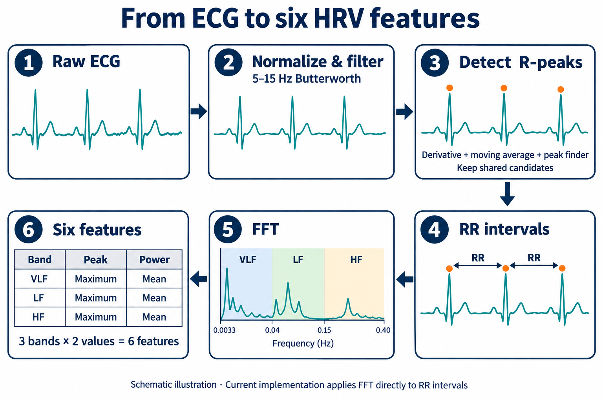

# ECG-based Diagnosis Model for Diabetes

*ECG 심전도 신호 기반 당뇨 진단모형*

**DGIST IBOM Lab (Intelligent Bio-Opto Mechatronics Laboratory)**

- Period: 2025.01.06-2025.02.05
- Role: Intern
- Supervisor: Cheol Song

## 1. Motivation

Diabetes can have serious health consequences, making early prediction important. If diabetes could be identified from ECG signals routinely collected in hospitals, this could provide an effective and accessible approach to detection.

## 2. Experimental Design

- **Data:** ECG time series contain timestamps and signal amplitudes. The classification dataset contains **30 samples (17 controls and 13 diabetes samples)** and a class label.
- **Feature extraction:** Process ECG signals into RR intervals, then use FFT to extract six HRV features: the maximum (peak) and mean (power) spectral values in the VLF, LF, and HF bands.
- **Signal processing:** Normalize and filter the ECG, detect R-peaks (heartbeat markers), and measure the time between consecutive peaks to obtain RR intervals.
- **Features:** Apply FFT to the RR intervals and extract the maximum(peak) and mean(power) spectral values in three bands: VLF (0.0033–0.04 Hz), LF (0.04–0.15 Hz), and HF (0.15–0.40 Hz), yielding **six features**.
- **Models:** Compare Logistic Regression, SVM, Random Forest, Gradient Boosting, and AdaBoost. Combine all five using soft voting, which averages their predicted class probabilities.

**Tools (Python):** NumPy, pandas, SciPy, scikit-learn, Matplotlib

## 3. Results

| Model | Training Accuracy | Validation Accuracy |
| --- | ---: | ---: |
| Logistic Regression | 66.67% | 50.00% |
| SVM | 62.50% | 50.00% |
| Random Forest | 100.00% | 66.67% |
| Gradient Boosting | 100.00% | 83.33% |
| AdaBoost | 100.00% | 66.67% |
| Soft Voting Ensemble | 100.00% | 83.33% |

The ensemble and Gradient Boosting each classified **5 of 6 validation samples correctly**. The ensemble did not outperform the best individual model. The small validation set and perfect training scores limit conclusions about generalization; these results do not establish clinical diagnostic performance.

Next steps include evaluation across all folds, more data, and revisiting HRV extraction: the current FFT implementation assumes a sampling rate without first interpolating RR intervals onto a uniform time grid.

**Project files:** [Final presentation](IBOM_250206_final_presentation_ver2.pptx)
